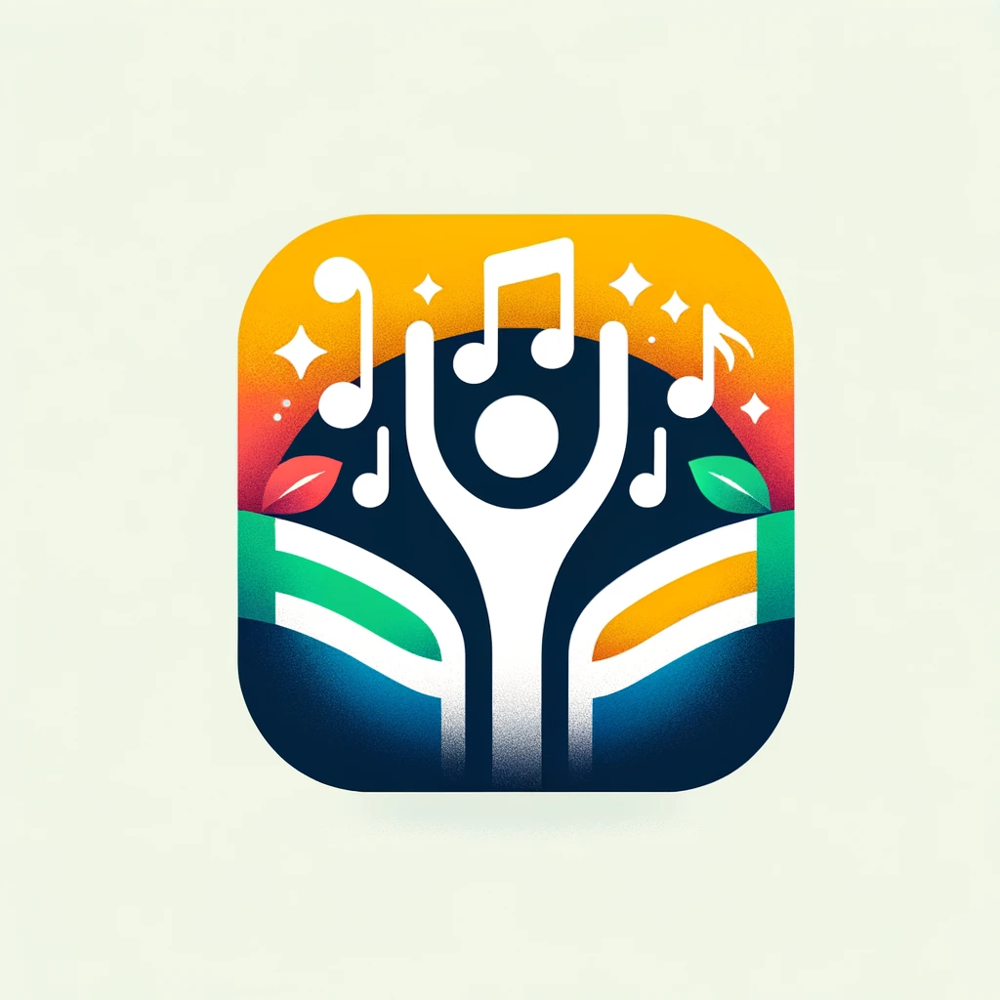

# Cantiga

In the rhythm of life, where each day brings a new verse, Cantina App emerges as the harmonious
melody that orchestrates the tasks of a family. Just as a song unites notes and chords into a
beautiful symphony, Cantina seamlessly integrates the diverse needs and schedules of your family,
creating a symphony of coordinated effort and shared responsibilities.

Imagine a world where the daily chorus of family life flows as smoothly as your favorite tune.
Cantina is that world, brought to life through your smartphone. With its intuitive interface,
this app allows each family member to contribute their unique voice to the family's daily routine.
Whether it’s coordinating pick-ups and drop-offs, managing grocery lists, or planning family
events, Cantina ensures that everyone stays in tune with each other’s needs and activities.

But Cantina is more than just a scheduler; it's a celebration of family unity, echoing the vibrant
and joyous rhythms of Brazilian culture. It encourages not only the sharing of tasks but also the
sharing of moments – the laughter, the stories, the songs of your family’s everyday life. In this
app, each task completed, each event planned, is like hitting the right note at the right time,
creating a melody of efficiency and harmony.

As the conductor of your family’s orchestra, you'll find peace of mind knowing that everyone is
playing their part. No more missed appointments or double-booked events – just smooth, harmonious
coordination. And in those moments where life hits a high note, Cantina is there to ensure that
you savor every beat.

So, let the music play and the tasks flow. With Cantina, your family life is not just a song;
it’s a symphony of synchronized beauty, joy, and togetherness. Download Cantina today, and
experience the rhythm of family harmony.
